# **Special Permissions**

---

## Introduction: Why Special Permissions Are Needed

There are three types of permissions – **Basic**, **ACL**, and **Special**.
**Special Permissions** are meant for **executable files** and **directories**. They include:

1. **Set User ID (SUID)**
2. **Set Group ID (SGID)**
3. **Sticky Bit**

These permissions give extra control over how files and directories behave. They’re like “special rules” on top of normal permissions to control ownership or privilege in specific situations.

---

## Part 1: Set Group ID (SGID)

### **Concept**

The **SGID** permission on a directory makes sure that any file or folder created inside it automatically takes the **group ownership** of the parent directory instead of the group of the user creating it.

This is useful when many users work together in the same directory and you want all files to stay in one group.

### **Description**

Normally, when a user creates a file inside a directory, the file gets the **user’s primary group**. With SGID, the file instead gets the **directory’s group**, making teamwork smoother.
It’s like saying, “Anything born here belongs to this family, not to outsiders.”

### **Commands & Examples**

1. **Preparation:**

   * Create a directory (e.g., `TCS`).
   * Create a group (e.g., `TataGroup`).
   * Change the directory’s group ownership to `TataGroup`.
   * Create users `user1`, `user2`, and `user3`.

2. **Initial Behavior (Without SGID):**

   * **Command:** `ls -ld TCS` and then create files inside.
   * **Output:** Files made by `user1` inside `TCS` are owned by `user1` and have the group `user1`.
   * **Meaning:** This is the default rule where the file gets the creator’s group.

3. **Setting SGID:**

   * **Command:** `chmod g+s TCS`
   * **Output:** Permissions now show an `s` in the group’s execute spot (`rwx rws rwx`).

4. **New Behavior (With SGID):**

   * Files created by `user1` now automatically have the group `TataGroup`.
   * This shows SGID is working because group ownership comes from the parent folder.

### **Analogy**

Think of a family surname: a child born into a family automatically gets the family’s surname. SGID works the same way for group ownership.
This extra rule keeps everything consistent inside shared directories.

## 🖥️ Lab: Using SGID on a Directory Step by Step

This guide shows how SGID makes all new files in a folder automatically inherit the folder’s group instead of the creator’s group.

---

### 1️⃣ Concept Recap

* **Without SGID:** When a user creates a file, the file gets that user’s primary group.

* **With SGID on a directory:** Any file created inside inherits the **directory’s group** instead.

* **Analogy:** Like a family surname — every “child” (new file) gets the “family” group name automatically.

---

### 🖥️ Step-by-Step Example – SGID on `TCS` folder

#### Step 1 – Setup

As root:

```bash
sudo groupadd TataGroup        # create a group
sudo mkdir /TCS                # create a directory
sudo chgrp TataGroup /TCS      # set its group to TataGroup
```

Check the directory:

```bash
ls -ld /TCS
```

Expected output:

```
drwxr-xr-x 2 root TataGroup 4096 Sep 16 11:00 /TCS
```

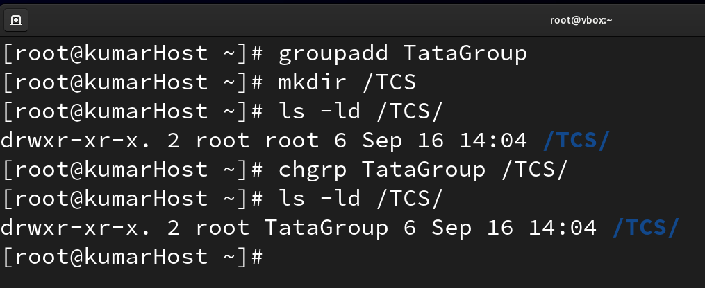
---

#### Step 2 – Add Users

```bash
sudo useradd user1
sudo useradd user2
sudo useradd user3

sudo gpasswd -a user1 TataGroup # or sudo usermod -aG TataGroup user1
sudo gpasswd -a user2 TataGroup # or sudo usermod -aG TataGroup user2
sudo gpasswd -a user3 TataGroup # or sudo usermod -aG TataGroup user3

```

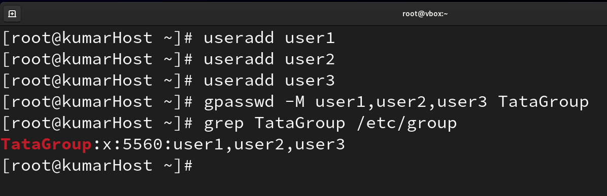
---

#### Step 3 – Default behaviour (without SGID)

Switch to `user1`:

```bash
su - user1
cd /TCS
touch file1.txt
ls -l
```

Expected output:

```
-rw-r--r-- 1 user1 user1 0 Sep 16 11:05 file1.txt
```

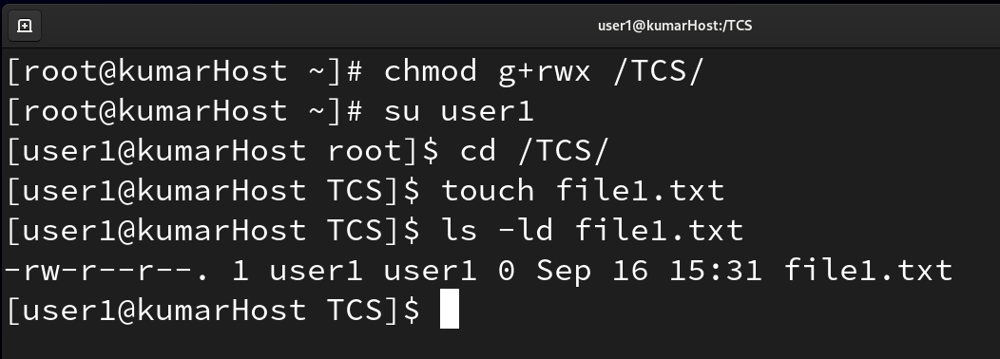

👉 Group = `user1` (the creator’s group). This is the default.

---

#### Step 4 – Enable SGID on the directory

Switch back to root:

```bash
exit
sudo chmod g+s /TCS
ls -ld /TCS
```

Expected output:

```
drwxr-sr-x 2 root TataGroup 4096 Sep 16 11:10 /TCS
```

👉 The **`s`** in the group’s execute place (`r-s`) shows **SGID is ON**.

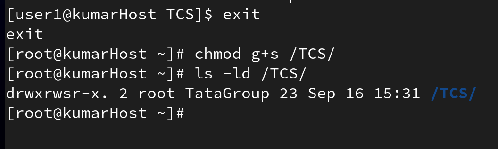

---

#### Step 5 – Test after SGID

Switch to `user2`:

```bash
su - user2
cd /TCS
touch file2.txt
ls -l
```

Expected output:

```
-rw-r--r-- 1 user2 TataGroup 0 Sep 16 11:15 file2.txt
```

👉 Group is now `TataGroup`, not `user2`. SGID is working.

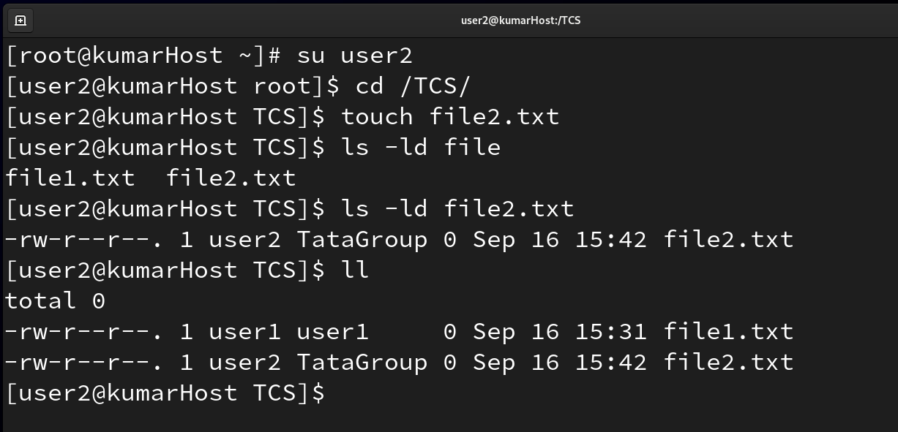

---

#### Step 6 – Verify with another user

Switch to `user3`:

```bash
su - user3
cd /TCS
touch file3.txt
ls -l
```

Expected output:

```
-rw-r--r-- 1 user3 TataGroup 0 Sep 16 11:20 file3.txt
```

All new files automatically have the group `TataGroup`.

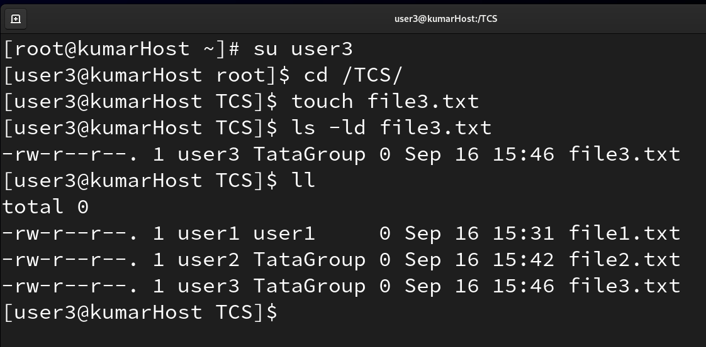

---

### Notes / Caution

* SGID only affects **group ownership** of new files/directories inside the folder.
* It doesn’t change existing files.
* It’s useful for shared project directories so every file stays in one group.

---

## Part 2: Set User ID (SUID)

### **Concept**

The **SUID** permission on an executable file lets a normal user run it with the **file owner’s permissions** instead of their own.

This is important for commands that need higher privileges but must be usable by non-admin users without giving them the actual password.

### **Description**

Without SUID, normal users cannot run certain system-level programs. With SUID, they temporarily “borrow” the file owner’s (often root’s) permissions only for that program.
It’s like giving someone a guest pass to do one specific action without giving them your full account.


## Commands & Examples (detailed, simple explanation)

### 1. What are “privileged commands”?

On Linux there are two broad types of commands:

* **Normal commands**: Things any user can run, like `ls`, `cd`, `mkdir` in your own home folder. They only affect your own files.

* **Privileged commands**: Programs that do things which affect the **whole system** or other users — e.g. change the hostname, configure the network, install software.

  These normally require administrator (root) rights because they could break security or stability if misused.

So when you hear “privileged command,” think **“a program that needs admin powers”**.

---

### 2. What is `nmtui`?

`nmtui` stands for **Network Manager Text User Interface**.
It’s a text-based program (runs in the terminal, not a graphical window) that lets you:

* Set up Wi-Fi or wired network connections
* Change network settings like IP address or DNS
* Change the system hostname

All of these are **system-level settings**. That’s why `nmtui` normally requires **root** privileges.

---

### 3. Initial Behavior (Without SUID)

If you log in as a normal user (say your username is `virat`) and type:

```bash
nmtui
```

You will likely see something like:

```
Permission denied
```

or it will ask for the root password. This is because by default the program runs with **your user’s permissions**. 

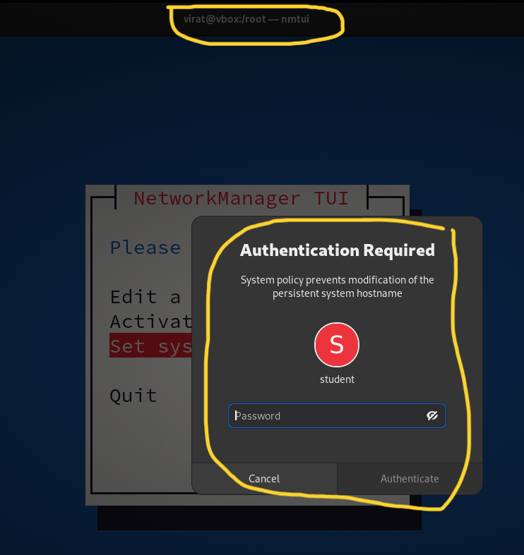

As a normal user you don’t have enough rights to change network settings or hostname.

---

### 4. Finding the Command’s Location

Every command is just a file somewhere on disk. To see where it lives you can type:

```bash
which nmtui
```

Typical output:

```
/usr/bin/nmtui
```

This shows the full path to the actual program file. You need this path if you want to change its permissions.

---

### 5. Setting SUID

An administrator (someone who already has root rights) can set the **SUID bit** on that program file:

```bash
chmod u+s /usr/bin/nmtui
```

This does not change what the program does, but it changes **how it runs**:

* When anyone runs `/usr/bin/nmtui`, the kernel will make it run with the **file owner’s permissions** (root), not the user’s.
* That way, normal users can now use the program without typing the root password.

Example session:

```bash
[virat@vbox root]$ exit
exit
```

➡️ Exits from the current shell back to root login.

```bash
[root@vbox ~]# ls -ld /usr/bin/nmtui
-rwxr-xr-x. 1 root root 817208 Feb 23 2023 /usr/bin/nmtui
```

➡️ Shows default permissions of `nmtui` (no `s`, only `x` for execute).

```bash
[root@vbox ~]# chmod u+s /usr/bin/nmtui
```

➡️ Adds the **setuid bit** so the program will run as root.

```bash
[root@vbox ~]# ls -ld /usr/bin/nmtui
-rwsr-xr-x. 1 root root 817208 Feb 23 2023 /usr/bin/nmtui
```

➡️ Now the owner’s execute bit is `s` (`rws`) — confirming that **SUID is active**.


---

### 6. Checking Permissions After Setting SUID

If you list the file’s details:

```bash
ls -l /usr/bin/nmtui
```

you will see something like:

```
-rwsr-xr-x 1 root root 123456 Sep 16 10:00 /usr/bin/nmtui
```

Key part: `rws` at the start instead of `rwx`.
This is telling you:

* **Lowercase `s`** — SUID is set *and* the owner has execute permission. This is the usual correct setup.
* **Uppercase `S`** — SUID is set but the owner does *not* have execute permission. This is rare and usually means a misconfiguration.

---

### 7. New Behavior (With SUID)

Now, when the user `virat` types:

```bash
nmtui
```

it opens successfully and allows things like changing the hostname or configuring the network **without asking for the root password**.

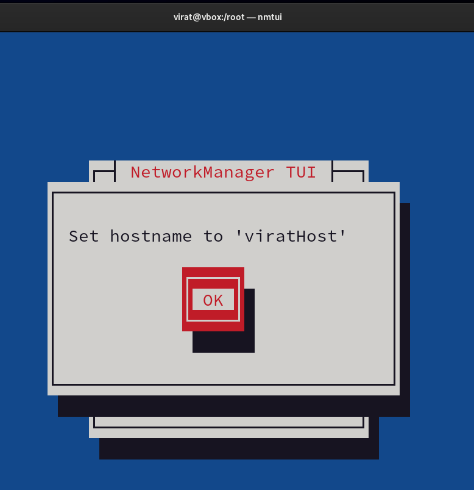

Why? Because now `nmtui` runs with **root’s permissions** (since the file is owned by root and SUID is on). The program temporarily has the rights it needs to do system-level work.

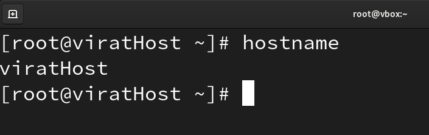

As soon as `nmtui` exits, `virat` goes back to being an ordinary user — no extra powers remain.

---

### 8. What actually happens when you set `u+s`

When you set `u+s` on `/usr/bin/nmtui`, the **kernel** makes the program run with the **file owner’s (root’s) permissions** while it executes.
That allows the program to do things that normally require root — for example:

* Change network settings
* Write files that only root can write

…but only if the program’s code actually performs those actions.
It does **not** turn you into root outside of that program.

Technically, when you run a setuid program:

* Your real user ID (RUID) stays as you (virat).

* The program’s **effective user ID (EUID)** becomes root.

* That EUID gives the program the ability to perform root-only operations while it runs.

### 9. What it doesn’t do

* It does **not** change your user account to root globally.

* It does **not** give you an interactive root shell (unless the program itself spawns one, which would be a huge security flaw).

* It does **not** change permissions on the directory or system permanently; it only lets the running program access things root can access.

* The elevated privilege applies only to that specific binary (`/usr/bin/nmtui`). Other programs you run still run with your normal user privileges.

* It only works for **binaries** (compiled executables). The setuid bit on **scripts** is typically ignored for security reasons.

### 10. All users get this effect

After you set `u+s` on `/usr/bin/nmtui`, **all users on the system** can run it with root privileges.
It doesn’t matter whether the user is deepak, john, or virat — when they run `nmtui`, the kernel sets the **effective UID to root**, so everyone gets the root-level effect inside that program.

That’s why this is considered **dangerous ⚠️**:

* If multiple users exist on the machine, you’ve given them all the ability to run `nmtui` as root.
* If `nmtui` has any security issue (for example, it lets you spawn a shell), every user could potentially become root.

### 11. Safer alternative for one specific user

If you want **only one user** (say, deepak) to run `nmtui` as root, use `sudo` instead of SUID. In `/etc/sudoers` you can add:

```
deepak ALL=(ALL) NOPASSWD: /usr/bin/nmtui
```

Then only deepak can run:

```bash
sudo /usr/bin/nmtui
```

Other users cannot. This is safer and auditable.


### 12. Analogy (in Windows terms)

This is like using **“Run as Administrator”** on Windows:

* You’re still the same user, but you’re telling Windows to run one program with admin rights.
* You get the higher rights only for that program, not everywhere else.
* This keeps the system safer because you’re not logged in as full admin all the time.

On Linux, the SUID bit achieves a similar result: it gives normal users just enough privilege to run that one program safely.

---


## Part 3: Sticky Bit

### 1️⃣ Concept in Simple Words

The **sticky bit** is a **special permission** you can put on a **directory** (not on files).

* Normally, if a directory is **writable by everyone** (like `chmod 777`), any user can **create**, **delete**, or **rename** files in it — even if they didn’t create the file.
* With the **sticky bit set**, everyone can still create files, but **they can only delete or rename their own files**.
* The **owner of the directory** and **root** can still delete everything, but regular users can’t touch each other’s files.

This is how Linux protects places like `/tmp` where every process writes temporary files but shouldn’t delete another process’s files.

---

### 2️⃣ How to Recognize It

* To set the sticky bit:

  ```bash
  chmod o+t <directory_name>
  ```

* To remove the sticky bit:

  ```bash
  chmod o-t <directory_name>
  ```

* In `ls -ld` output, you’ll see a **`t`** at the end of the permission string:

  * **Lowercase `t`**: Others have **execute** permission **and** sticky bit is set.
  * **Uppercase `T`**: Others **don’t** have execute permission but sticky bit is still set.

This last character in the “others” section is your visual clue.

---

### 3️⃣ Analogy

Think of a big shared **locker room**:

* Everyone has access and can put their own bag inside.
* Without sticky bit: anyone can walk off with anyone else’s bag.
* With sticky bit: you can only take your own bag out; other bags are locked from your reach.

---

### 4️⃣ The Example Explained

```bash
chmod 777 data
chmod o+t data
```

* `chmod 777 data` makes `data` a **public folder** — anyone can read/write/execute inside it.
* `chmod o+t data` puts the **sticky bit** on top of that.
* This makes it behave like `/tmp`:

  * Amir can create files.
  * Salman can create files.
  * Shahrukh can create files.
  * **But** Salman cannot delete Amir’s files, and vice versa.

This is the protection mechanism. It’s a **safety net** for open areas.

---

### 5️⃣ Effect Summarized

* ✅ Users can create files.
* ✅ Users can delete/rename **their own files**.
* ❌ Users cannot delete/rename **other users’ files**.
* 👑 Root and directory owner can still delete everything.

---

## 🖥️ Lab: Sticky Bit in Action

Below is a **step-by-step demonstration** you can run on your system.
Every step includes commands, expected output, and a placeholder for a screenshot.

---

### Step 1 – Setup the shared directory

As root:

```bash
mkdir /data
chmod 777 /data
```

Check the directory:

```bash
ls -ld /data
```

Expected output:

```
drwxrwxrwx 2 root root 4096 Sep 16 11:00 /data
```

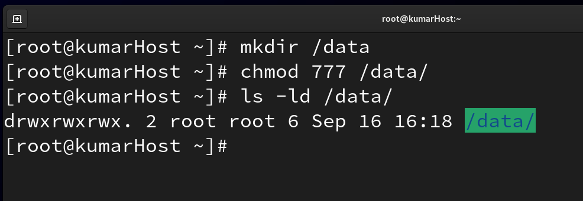

This means **everyone** can read, write, and enter `/data`.

---

### Step 2 – Create users

```bash
sudo useradd amir
sudo useradd salman
sudo useradd shahrukh
```

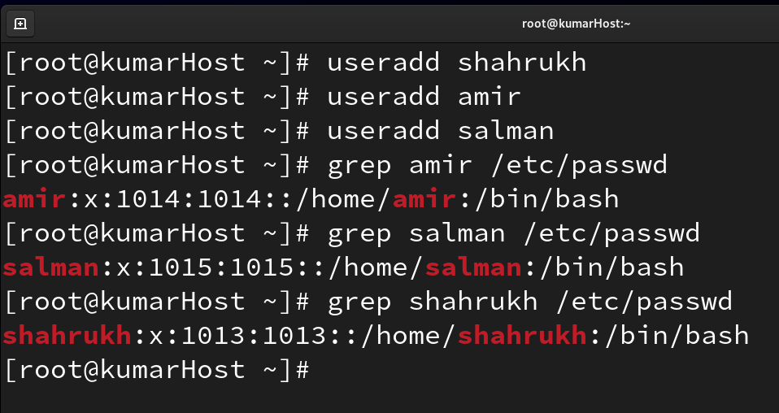

---

### Step 3 – Test default behaviour (without sticky bit)

Switch to `amir`:

```bash
su - amir
cd /data
touch amir_file.txt
ls -l
```

Expected output:

```
-rw-r--r-- 1 amir amir 0 Sep 16 11:05 amir_file.txt
```

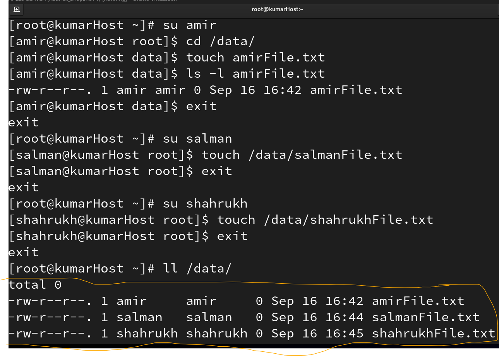

Switch to `salman`:

```bash
su - salman
cd /data
ls -l
rm amir_file.txt
```

**Result:** File deleted successfully!
This shows that without sticky bit, **anyone can delete anyone else’s file**.

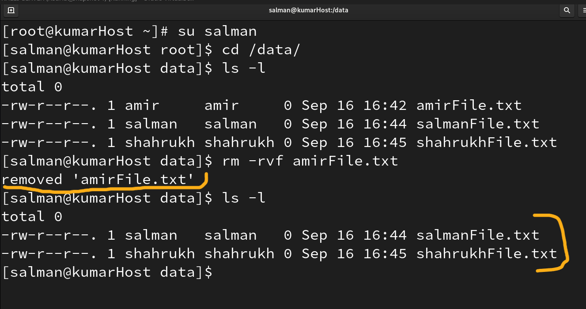

---

### Step 4 – Enable sticky bit

Switch back to root:

```bash
exit
sudo chmod o+t /data
ls -ld /data
```

Expected output:

```
drwxrwxrwt 2 root root 4096 Sep 16 11:10 /data
```

Notice the **`t`** at the end (`drwxrwxrwt`).
This is the sticky bit indicator.

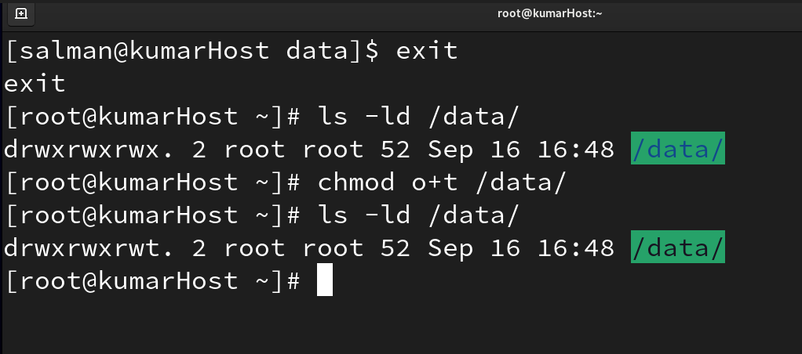

---

### Step 5 – Test behaviour with sticky bit

Switch to `amir`:

```bash
su - amir
cd /data
rm -rvf salmanFile.txt
```
Expected output:

```
rm: cannot remove 'salmanFile.txt': Operation not permitted
```

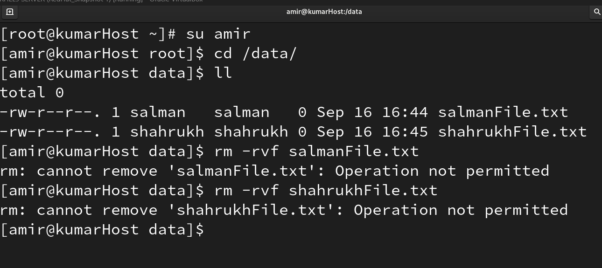

Now amir **cannot delete Salman’s file** because of the sticky bit.
He can still create his own files:


### Step 6 – Remove sticky bit

Switch to root:

```bash
sudo chmod o-t /data
ls -ld /data
```

Expected output:

```
drwxrwxrwx 2 root root 4096 Sep 16 11:25 /data
```

Now the `t` disappears and the directory is open again.
Any user can once again delete other users’ files.

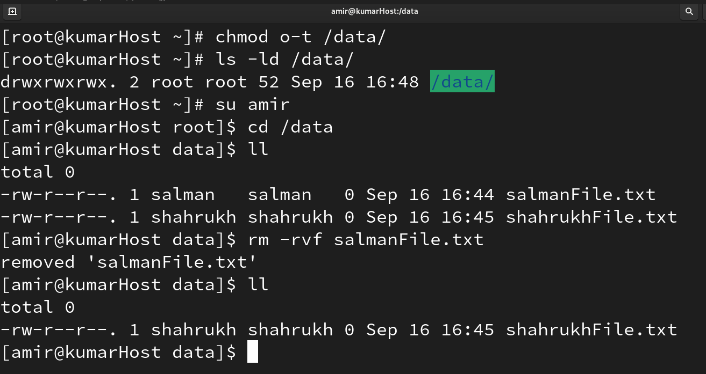

---

### ✅ Final Result

* **Before sticky bit:** Any user could delete any other user’s files in `/data`.
* **After sticky bit:** Each user can only delete/rename their **own** files.
* **Indicator:** The `t` at the end of permissions string (`drwxrwxrwt`).
* **Use case:** Shared directories like `/tmp`, `/var/tmp`, or team folders where everyone writes but shouldn’t delete each other’s files.

---


## Part 4: Numerical Representation of Special Permissions

Special permissions also have **numbers** like normal permissions. A **fourth digit** is added in front:

* **SUID:** `4`

* **SGID:** `2`

* **Sticky Bit:** `1`

### **Commands & Syntax**

* **Setting SUID:** `chmod 4755 <file_name>`

* **Setting SGID:** `chmod 2755 <file_name>`

* **Setting Sticky Bit:** `chmod 1755 <file_name>`

You can **add** numbers to set multiple special permissions at once (e.g., `4` + `2` = `6`).

*Example:* `chmod 6755 <file_name>` sets both SUID and SGID.

**Removing Special Permissions:**

Set the first digit to `0` (e.g., `chmod 0755 <file_name>`).

This numeric method is a shortcut; the symbolic method (`u+s`, `g+s`, `o+t`) works just as well and is easier to read.

So you can pick whichever style makes more sense to you.

---

## Part 4: Hidden Files & Home Directory Example

Sometimes, when moving or changing a user’s home directory, problems appear because of **hidden files**.

### **Observation:**

If the new home directory does not have the hidden files from the old one, the shell may give errors (like missing `.bash_profile`).

These hidden files store important settings for the user’s environment.

### **Solution:**

1. Make sure the new home directory has correct ownership and permissions (e.g., `chown user:user new_home`).

2. Copy all hidden files from the old home to the new one using `cp -a`.

### **Useful Commands:**

* `ls -a` – lists all files, including hidden ones (those starting with a dot).
* `mv .<file_name> <new_name>` – unhides a file by removing the dot at the start.

Copying these hidden files ensures the user’s shell and environment work exactly as before.

---
